# User Documentation

#### Running from Source Code

1. Download the source code from GitHub

```bash
git clone https://github.com/ez-captcha/ez-shark
```

2. Install dependencies

```bash
pnpm install
```

3. Run

```bash
pnpm tauri dev
```

#### Download from Release

ez-shark.exe is a portable version that can be run directly.  
ez-shark_0.5.0_x64-setup.nsis.exe is the NSIS installer version.  
ez-shark_0.5.0_x64_en-US.msi is the MSI installer version. After installation, run ez-shark.exe.

## How to Use

When you open ez-shark.exe, the interface looks like this:  
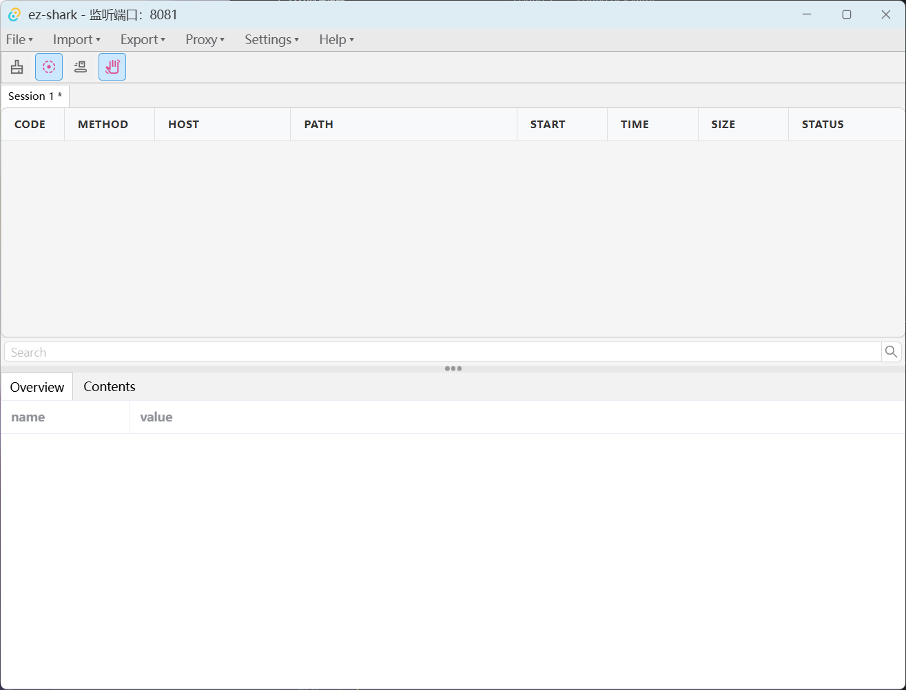

#### Operation Bar

1. File menu - For creating new sessions
2. Import menu - For importing sessions, Charles files, and HAR files
3. Export menu - For exporting sessions, HAR, JSON, CURL, and Markdown files
4. Proxy menu - For setting up traffic breakpoints and external proxies
5. Setting menu - For configuring listening ports and Charles path
6. Help menu - For viewing help documentation and installing certificates

#### Function Buttons

1. Clear List

   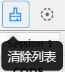

   When activated, this will clear all data in the list.

2. Start/Stop Listening

   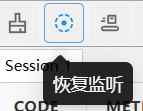

   When activated, it will start/pause monitoring all traffic on the specified port.

3. Auto Scroll

   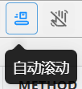

   When activated, if new traffic is monitored, it will automatically scroll to the bottom of the list.

4. Toggle Breakpoint

   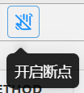

   When activated, it will disconnect/connect all traffic on the specified port.

#### Traffic Monitoring

When traffic monitoring is activated, the current session name will have a `*` identifier (e.g., `Session 1 *`).  
If traffic passes through the monitored port, traffic information will be displayed in the list, as shown below:

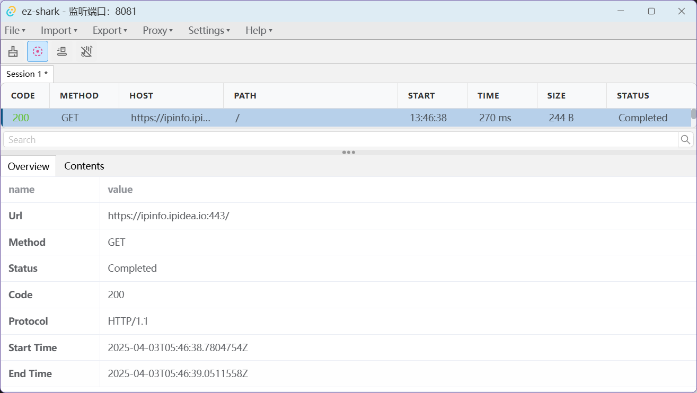

#### Traffic List

- Each item in the traffic list can be sorted in ascending/descending order by clicking on the header.
- When right-clicking a row of traffic information in the traffic list, you have the following options:

  - `Breakpoint`: Quickly add/remove breakpoints.  
    This option matches the complete URL and request method of the traffic in the `Proxy -> Breakpoint Settings` menu to check if there are matching conditions. If there are, it removes that breakpoint data. If not, it adds that breakpoint data.
  - `Resend`: Quickly resend traffic. This option opens the traffic editing window and passes the traffic URL, request headers, and request body to that window. Users can modify the traffic's URL, request headers, request body, and other information before clicking the `Execute` button to send the modified traffic.
  - `Copy URL`: Quickly copy the traffic's URL.
  - `Delete`: Quickly delete that traffic information.
  - `Copy`: When the mouse hovers over this menu item, it will display:
    - `Request Body`: Quickly copy the traffic's request body to the clipboard.
    - `Response Body`: Quickly copy the traffic's response body to the clipboard.
    - `Markdown`: Quickly copy the traffic's Markdown format to the clipboard.
    - `CURL`: Quickly copy the traffic's CURL format to the clipboard.
    - `HAR`: Quickly copy the traffic's HAR format to the clipboard.

- In the traffic list, you can use shift+left click on two traffic entries to multi-select all traffic within that range, or use ctrl+left click to multi-select individual traffic, or directly press and drag the left mouse button to select all traffic within a range. After multi-selecting traffic, you can use the right-click menu for batch operations, such as deletion.

- Click on a traffic information row in the list to view detailed information for that row.
- You can preview the content of the traffic in the detailed information section below.

#### Traffic Detailed Content

Click on the Contents tab to view the detailed content of the traffic.  
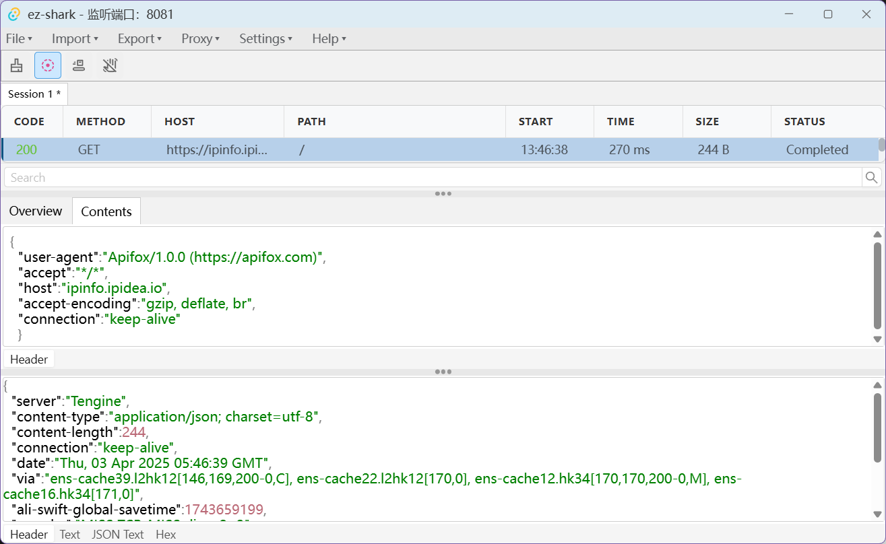  
The `Headers` tab allows you to view the request and response headers of the traffic.  
The `Text` tab allows you to view the request and response bodies of the traffic. When the traffic is common image data, it will automatically parse the image into base64 format.  
The `Cookies` tab allows you to view the Cookie information in the request and response headers of the traffic.  
`JSON Text` if the request/response body is in JSON format, it will be automatically parsed into JSON format.  
The `Hex` tab allows you to view the Hex format of the request and response bodies of the traffic.  
`Img` if the request/response body is in image format, it will try to parse the image in base64 format.

#### Traffic Breakpoints

To use this feature, you first need to set up a proxy in the `Proxy -> Breakpoint Settings` menu.  
When you open the breakpoint settings for the first time, the form looks like this:  
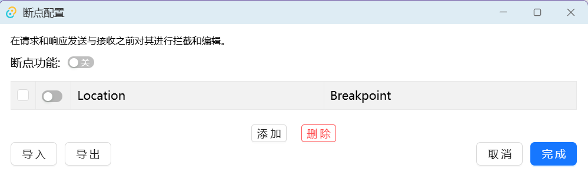  
Click add to open the breakpoint add menu, the form looks like this:  
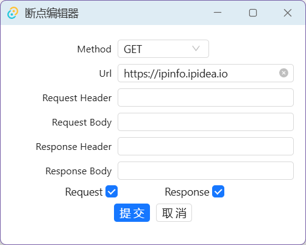  
`Method` indicates the method of the request, such as GET, POST, etc.  
`Url` indicates the URL of the request, which can be a partial URL or a complete URL.  
`Request Header | Request Body` indicates the Header or Body of the request, which can be a partial Header or Body, or a complete Header or Body.  
`Response Header | Response Body` indicates the Header or Body of the response, which can be a partial Header or Body, or a complete Header or Body.  
`Request` indicates that traffic will be matched when making a request.  
`Response` indicates that traffic will be matched when responding.

After filling out the form, click the submit button to add the breakpoint.  
After the breakpoint is successfully added, breakpoint information will be displayed in the list, as shown below:  
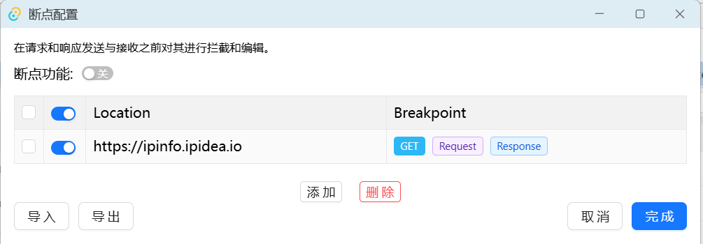

At this point, you can right-click on the row data to choose to edit or delete the breakpoint.

When traffic hits a rule, a traffic breakpoint editing window will pop up, as shown below:  
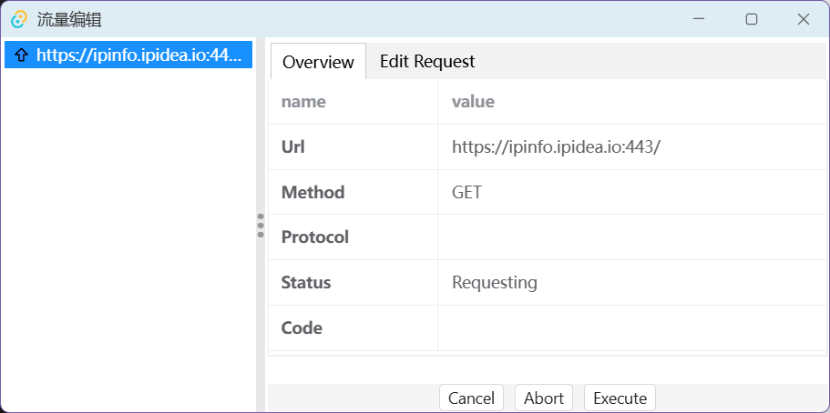

Click the `Edit Request/Response` button to edit the request and response of the traffic.  
You can modify the URL, Header, Body, and other information of the traffic.

Click the `Cancel` button to send the original traffic packet. Click the `Abort` button to interrupt the original traffic packet. Click the `Execute` button to send the edited traffic packet.

#### External Proxy

To use this feature, you first need to set up a proxy in the `Proxy -> External Proxy Settings` menu. (Currently only HTTP proxy is supported)  
After filling in the information, click the save button to save the proxy information.  
When this feature is turned on, all traffic will be sent through the external proxy.
