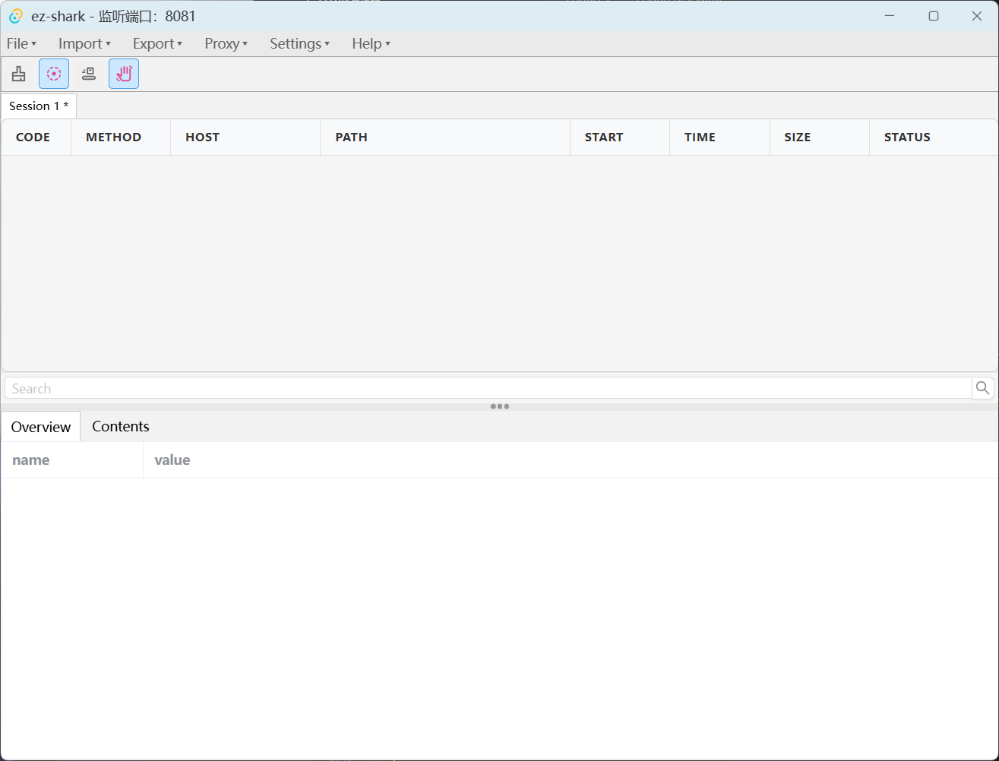
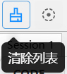
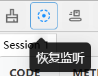
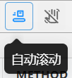
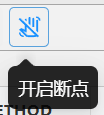
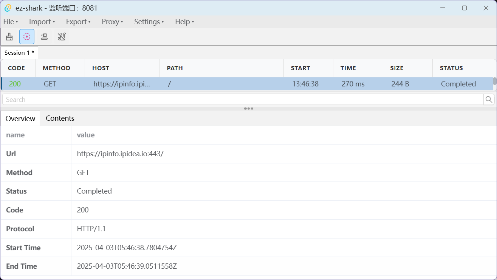

# 使用文档

#### 从源码运行

1. 从github下载源码

```bash
git clone https://github.com/ez-captcha/ez-shark
```

2. 安装依赖

```bash
pnpm install
```

3. 运行

```bash
pnpm tauri dev
```

#### 从release下载

ez-shark.exe 为免安装版本，直接运行即可。  
ez-shark_0.5.0_x64-setup.nsis.exe 为nsis安装版。  
ez-shark_0.5.0_x64_en-US.msi 为msi安装版。安装后运行ez-shark.exe即可。

## 使用方法

打开ez-shark.exe界面如下所示：  


#### 操作栏

1. File菜单 用于新建session
2. Import菜单 用于导入session、Charles、HAR文件
3. Export菜单 用于导出session、HAR、JSON、CURL、Markdown文件
4. Proxy菜单 用于设置流量断点与外挂代理
5. Setting菜单 用于设置监听端口与Charles路径
6. Help菜单 用于查看帮助文档与安装证书

#### 功能按钮

1. 清除列表

   

   激活后会清空列表中的所有数据。

2. 开关监听

   

   激活后会 开始/暂停 监听指定端口中的所有流量，

3. 自动滚动

   

   激活后如果有新的流量被监听，会自动滚动到列表底部。

4. 开关断点

   

   激活后会 断开/连接 监听指定端口中的所有流量。

#### 流量监听

当流量被监听被激活后当前的session名会有一个 `*` 标识（如`Session 1 *`）  
如有流量从监听端口经过会在列表中显示流量信息，如下图所示



#### 流量列表

- 流量列表的每一项都可以通过点击表头正序/倒序排序。
- 在流量列表处右键一行流量信息时,可有以下选择:

  - `Breakpoint`: 快速 添加/删除 断点。  
    该选项会把流量的完整url和请求方法在`Proxy -> Breakpoint Settings`菜单中匹配是否有符合条件的流量，如果有则删除该断点数据。如果没有则添加该断点数据。
  - `Resend`: 快速 重发 流量。该选项会打开流量编辑窗口，并且把流量URL、请求头、请求体传入该窗口，用户可以修改流量的URL、请求头、请求体等信息后点击`Execute`按钮发送修改后的流量。
  - `Copy URL`: 快速复制流量的URL。
  - `Delete` : 快速该条删除流量信息。
  - `Copy` : 当鼠标移入该菜单项时会显示
    - `Request Body` : 快速复制流量的请求体到剪贴板。
    - `Response Body` : 快速复制流量的响应体到剪贴板。
    - `Markdown` : 快速复制流量的Markdown格式到剪贴板。
    - `CURL` : 快速复制流量的CURL格式到剪贴板。
    - `HAR` : 快速复制流量的HAR格式到剪贴板。

- 在流量列表中可以使用shift+鼠标左键2个流量来多选区间的所有流量，或者使用ctrl+鼠标左键多选单个流量，或者直接按下鼠标左键拖动选择区间的所有流量。多选流量后可以使用右键菜单进行批量操作，如删除等。

- 点击列表中的流量信息行可以查看该行的详细信息。
- 可以在下方详细信息处预览流量的内容。

#### 流量详细内容

点击Contents标签页可以查看流量的详细内容。  
  
`Headers` 标签页可以查看流量的请求头与响应头。  
`Text` 标签页可以查看流量的请求体与响应体，当流量为常见图片数据时会自动解析图片为base64格式。  
`Cookies` 标签页可以查看流量的请求头与响应头中的Cookie信息。  
`JSON Text` 如果请求/响应体为JSON格式，会自动解析为JSON格式。  
`Hex` 标签页可以查看流量的请求体与响应体的Hex格式。  
`Img` 如果请求/响应体为图片格式，会尝试用base64格式解析图片。

#### 流量断点

使用该功能需要首先在`Proxy -> Breakpoint Settings`菜单中设置好代理。  
首次打开断点设置，表单如下所示  
  
点击添加打开断点添加菜单，表单如下所示  
  
`Method` 表示请求的方法，如GET POST等。  
`Url` 表示请求的URL，可以是部分URL，也可以是完整URL。  
`Request Header | Request Body` 表示请求的Header或Body，可以是部分Header或Body，也可以是完整Header或Body。  
`Response Header | Response Body` 表示响应的Header或Body，可以是部分Header或Body，也可以是完整Header或Body。  
`Request` 表示流量在请求的时候会被匹配。  
`Response` 表示流量在响应的时候会被匹配。

填写好表单后点击提交按钮即可添加断点。  
断点添加成功后会在列表中显示断点信息，如下图所示  


此时右键行数据可以选择编辑或者删除断点。

当有流量命中规则后，会弹出流量断点编辑窗口，如下图所示  


点击`Edit Request/Response`按钮可以编辑流量的请求与响应。  
可以修改流量的URL、Header、Body等信息。

点击`Cancel`按钮会发送原流量包。点击`Abort`按钮会中断原流量包。点击`Execute`按钮可以发送编辑后的流量包。

#### 额外代理

使用该功能需要首先在`Proxy -> External Proxy Settings`菜单中设置好代理。(暂目前只有http代理支持)  
在填写信息后点击save按钮即可保存代理信息。  
当该功能打开时，所有的流量会经过额外代理发送。
